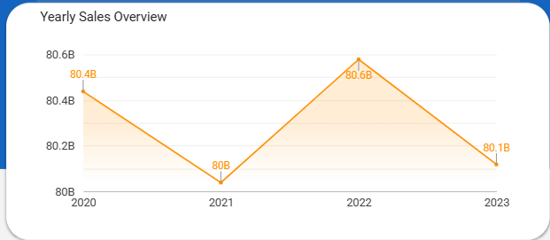
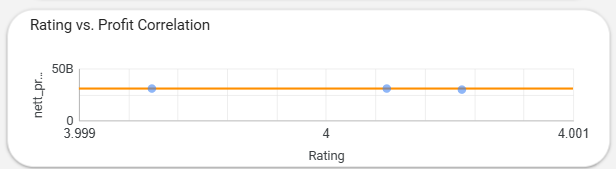

# 💊 Kimia Farma Performance Analysis (2020–2023)
A data analytics project using **Google BigQuery** and **Looker Studio**, designed to evaluate Kimia Farma's business performance and identify key drivers for improvement through a **Three-Layer Analytical Approach** (Performance → Driver → Improvement).

---

## 📊 Project Overview
This project provides a data-driven analysis of Kimia Farma’s performance from 2020 to 2023, focusing on sales trends, profit fluctuations, customer satisfaction, and product performance across regions and branches.

**Objectives:**
- Evaluate overall business performance using BigQuery-based data aggregation.
- Identify key drivers of profitability and customer experience.
- Deliver actionable recommendations to support strategic decisions.

---

## 🧠 Tools & Technologies
- **Google BigQuery** → Data transformation and analysis  
- **Google Looker Studio** → Interactive dashboard visualization  
- **SQL** → Query logic, metrics calculation (nett sales, nett profit, rating)

---

## 📁 Project Structure

Kimia_Farma_Dashboard/
│
├── Dataset/                # Raw & cleaned dataset
├── img/                    # Dashboard screenshots
├── README.md
├── Kimia_Farma.sql
└── Kimia_Farma_Report.pdf

---

## 🗺️ Data Flow
1. Upload raw CSV dataset to **Google Cloud Storage**  
2. Load data into **BigQuery tables**  
3. Clean and transform data using SQL (joins, metrics, aggregations)  
4. Create final view for visualization  
5. Connect to **Looker Studio Dashboard**

---

## 📊 Dashboard Preview
Here’s the main dashboard view showcasing Kimia Farma’s sales, profit, rating, and product performance:

*Figure 1: Kimia Farma Performance Dashboard in Looker Studio*

> Built using **BigQuery** and **Looker Studio**, this dashboard highlights yearly sales trends, top-performing regions, rating–profit correlations, and product category insights.

---

## 💡 Key Insights

*Figure 2: Kimia Farma Yearly Sales Overview*

1.Total Net Sales reached IDR 321.2 billion and Net Profit was IDR 91.2 billion, with total transactions exceeding 672,000 in the 2020–2023 period.
2. An average customer rating of 4.0 indicates a relatively stable customer experience, but still requires improvement.
3. Based on the Yearly Sales Overview, Kimia Farma's revenue decreased by 0.5% in 2021, as the second wave of COVID-19 depressed sales activity. Revenue increased again in 2022 by 0.67%, but then declined slightly by 0.57% in 2023, indicating that the company's performance has not fully stabilized even after the pandemic has ended.
> Revenue fluctuations between years indicate external or operational factors affecting business performance.

*Figure 3: Kimia Farma Regional Perfomance*

1. West Java was the largest contributor to transactions, Net Profit, and Net Sales, followed by North Sumatra, Central Java, East Java, North Sulawesi, and Riau.
2. High transaction activity in densely populated areas indicates significant market potential in western Indonesia.
> The dominant contribution was in western Indonesia. This suggests that expansion strategies and service optimization should be focused primarily on high-demand provinces to increase efficiency and strengthen Kimia Farma's market position nationally.

*Figure 4: Kimia Farma Rating Perfomance*

1. Several branches such as Pematangsiantar, Jambi, Sorong, Batam and Cilacap have a high gap rating (0.7–0.8), meaning they have a good reputation but customers rate their transaction experience as low, which may be due to service issues.

*Figure 5: Kimia Farma Rating vs Profit Perfomance*

1. The correlation between ratings and profits shows a weak positive relationship. Therefore, the focus should be on improving service only in branches with a high rating gap.

---

## Recommendation
1. Focus on expanding services, product stock, and marketing campaigns in the western region of Indonesia while gradually starting to reach the eastern market.
2. Standardize service SOPs and conduct frontline training at branches with the highest gap ratings to improve service quality.
3. Strengthen supply control on high-demand products while developing promotions in other potential health categories.
4. Actively use the dashboard for regional performance monitoring, branch evaluation, and more efficient product stock planning.

> “Kimia Farma 2024 will focus on sustainable growth through regional expansion, customer experience enhancement, and product portfolio optimization — powered by data-driven insights.”

---

## 👩‍💻 Author
**Nida Febiana**  
Data Enthusiast  
📧 [febiananida@gmail.com@gmail.com]  
🔗 [LinkedIn Profile](www.linkedin.com/in/nida-febiana)

---

